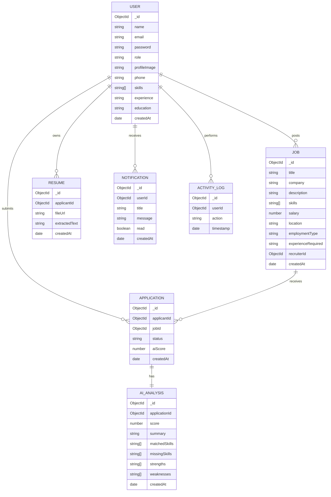

# ATS Database ER Diagram

## References

- `Job.recruiterId` references `User`.
- `Application.applicantId` references `User`.
- `Application.jobId` references `Job`.
- `Resume.applicantId` references `User`.
- `AIAnalysis.applicationId` references `Application`.
- `Notification.userId` references `User`.
- `ActivityLog.userId` references `User`.

## Indexes

- `User.email`
- `Job.title`
- `Job.skills`
- `Job.location`
- `Application.applicantId + Application.jobId`
- `Resume.applicantId`
- `AIAnalysis.applicationId`
- `Notification.userId + Notification.read`
- `ActivityLog.userId + ActivityLog.timestamp`
